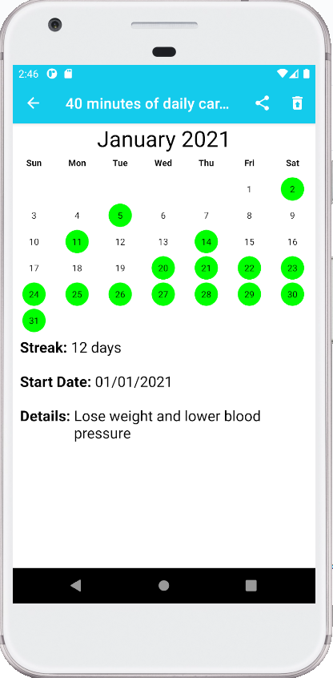
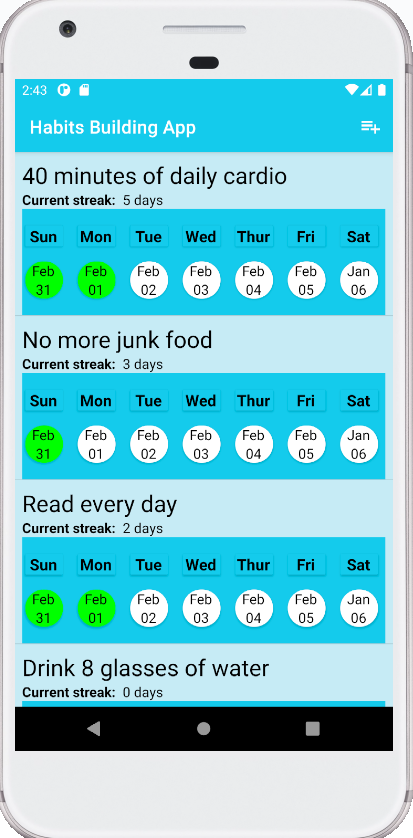
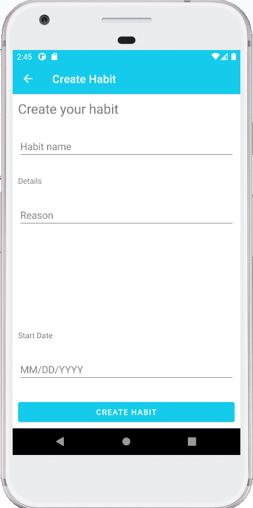

# Habits Building App
This app is developed for users to build habits by keeping track of ongoing streaks to help achieve long-term goals.

## Setup

Android's SQLite database is used in order to store user data due to potentially large data sets from date inputs for corresponding habits. 
Separate open source SundeepK's [CompactCalendarView](https://github.com/SundeepK/CompactCalendarView) is used instead of built-in CalendarView 
from Android because of highlighting date feature.

- Custom week view allows user to scroll to previous week to check off completed habits.

- User can give reasons why they want to create their habit and share with others.

